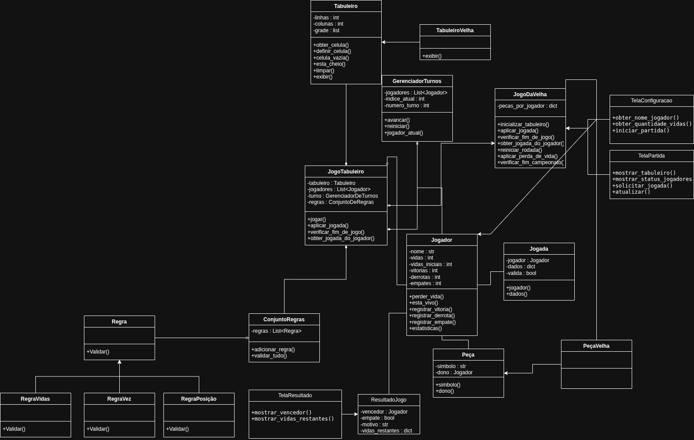
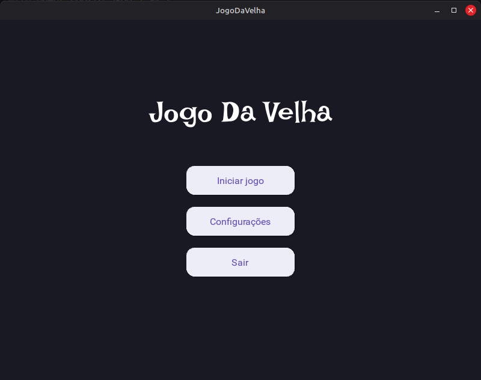
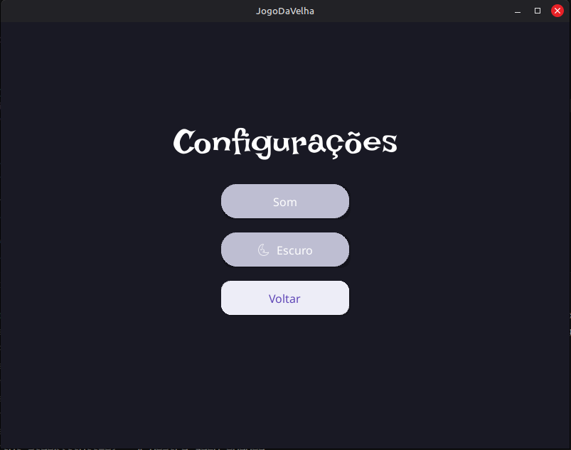
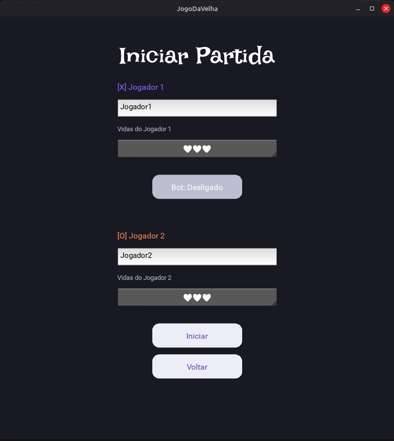
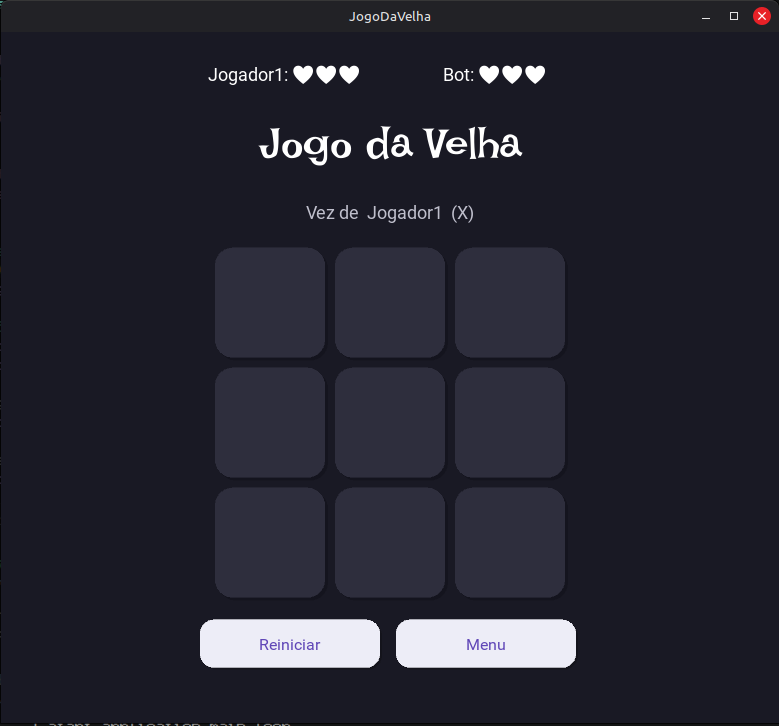
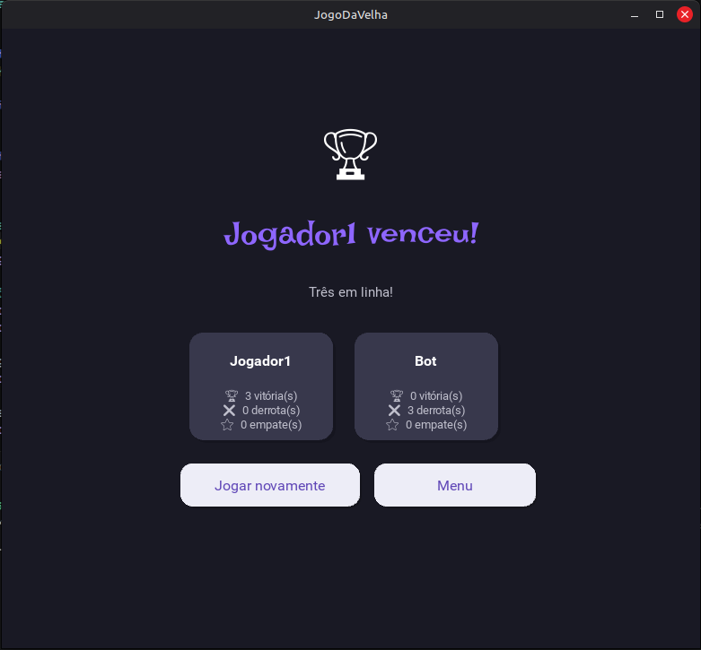

# 🎲 Jogos de Tabuleiro — POO com Python

Projeto desenvolvido para a disciplina de **Programação Orientada a Objetos**.<br/> 
Implementa uma arquitetura extensível para jogos de tabuleiro, com um jogo funcional: **Jogo da Velha**.

---

## #️⃣ Jogo da Velha

A proposta é um jogo da velha simples em rodadas definidas pelos próprios jogadores **(sistema de vida)**.<br/><br/>
Cada rodada será decidida através de uma vitória e, consequentemente, uma derrota. Em casos de empate, a rodada é **redefinida** até que haja um vencedor.<br/><br/>
Após a barra de vida de um jogador se esgotar, a partida acaba e a tela de resultados é mostrada com vencedor da partida.

---

## Sobre o uso de IA

A IA foi principalmente utilizada para entender e pesquisar sobre a sintaxe do Kivy e seus componentes, facilitando o estudo do framework e suas aplicações no projeto, e para apoiar a confecção deste ReadMe.

---

# Integrantes

- **Gabriel Masson Rosa**
- **Gabriel Reis**

---

# Como instalar e executar:

## Pré-requisitos

- Python **3.8+** instalado → [python.org](https://www.python.org/downloads/)
- pip atualizado

---

## 📦 Instalação

### 1. Clone o repositório
```Bash
git clone https://github.com/gabrielbr4000/poo-jogo-da-velha.git
cd poo-jogo
```

### 2. Crie um ambiente virtual (recomendado)

```bash
# Criar
python -m venv venv

# Ativar — Windows
venv\Scripts\activate

# Ativar — Linux / macOS
source venv/bin/activate
```

### 3. Instale as dependências

```bash
pip install -r requirements.txt
```

---

## ▶️ Executando o projeto

```bash
python main.py
```

### ou

```bash
python3 main.py
```

---

## 🖥️ Instalação por sistema operacional

### Windows

```bash
pip install kivy[base] kivy_examples
```

### Linux (Ubuntu/Debian)

```bash
sudo apt update
sudo apt install python3-pip python3-venv libsdl2-dev libsdl2-image-dev \
     libsdl2-mixer-dev libsdl2-ttf-dev
pip install kivy
```

### macOS

```bash
pip install kivy
```

---

# Diagrama de Classes

<div align="center">
  
</div>

---

# Telas do APP

## Menu Principal
<div align="center">
  
</div>

## Tela de Configurações
<div align="center">
  
</div>

## Tela de Configurações de Partida
<div align="center">
  
</div>

## Tela da Partida
<div align="center">
  
</div>

## Tela de Resultados
<div align="center">
  
</div>
